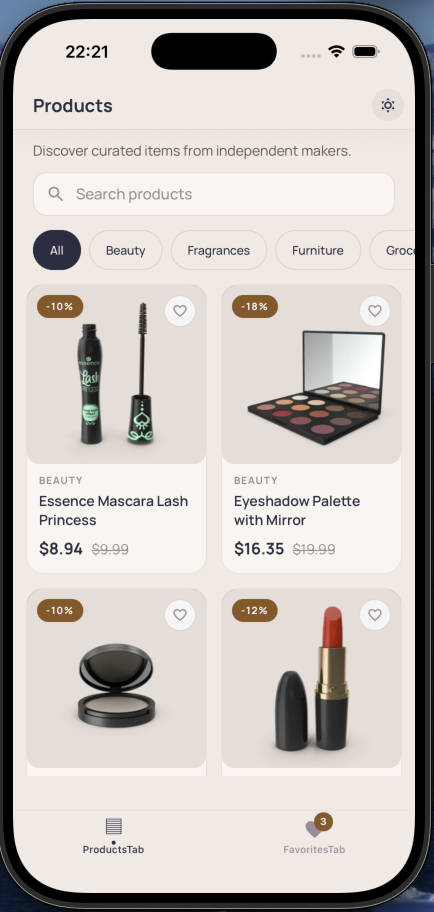
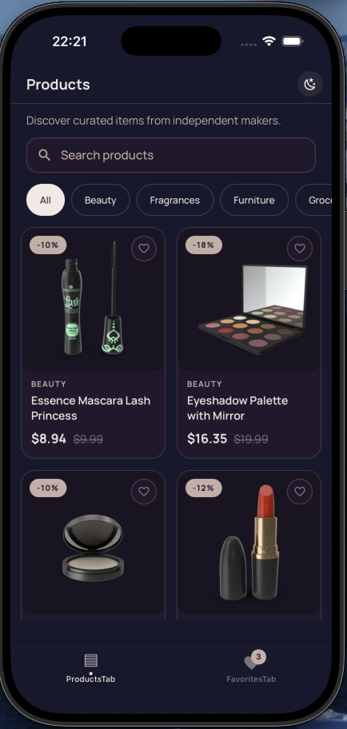
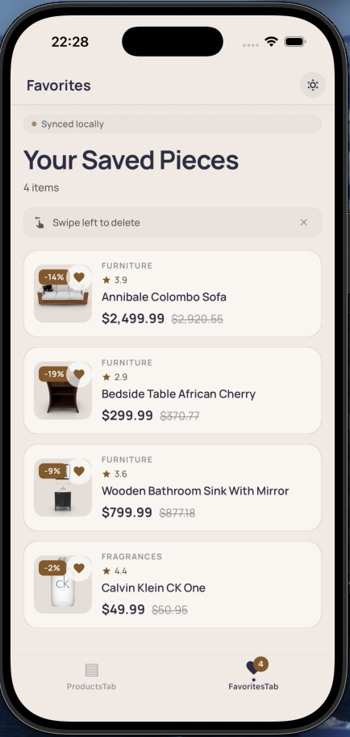
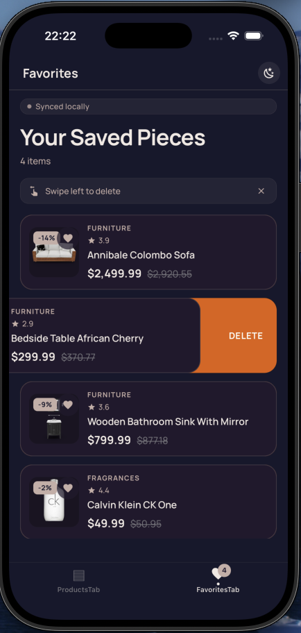
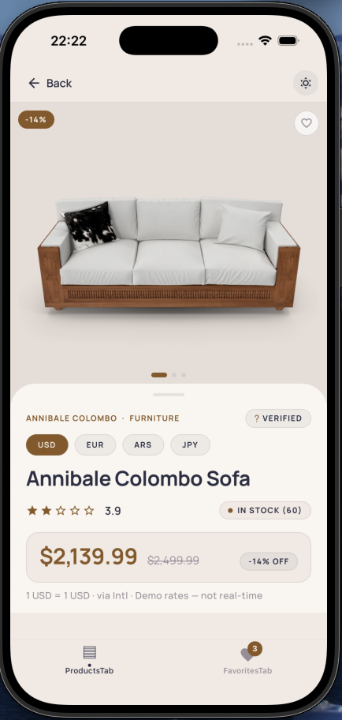
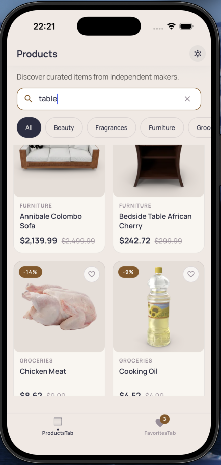
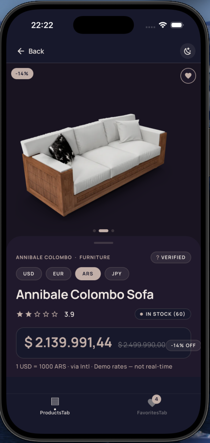

# react-native-products-topaz

Catálogo de productos en React Native 0.81 con búsqueda, categorías, detalle y favoritos.
Scaffold desde `@react-native-community/cli@20`, arquitectura por capas
(`domain` → `api` / `storage` → `feature/repository` → `feature/hooks` → `feature/components` → `screens`),
TanStack Query para estado del servidor, Zustand + MMKV para persistencia local.


---

## Arquitectura

basado en la propuesta de la prueba, aunque agrega features, pues mantiene toda la funcionalidad por carpetas, organizando recursos del feature en subcarpertas para.  mejor mantenibilidad, theme pues agregue soporte light dark, ademas de centralizar en variables las caracteristicas como espaciados, colores fuentes.

```
                UI (Screens, Components)
                       │
                       ▼
        Feature Hooks (TanStack Query / Zustand)
                       │
                       ▼
            Repository (interface + concrete)
                       │
            ┌──────────┴──────────┐
            ▼                     ▼
       Api Module           Storage Adapter
            │                     │
            ▼                     ▼
       httpClient ──► fetch     MMKV
```

Las reglas de dependencia se fuerzan vía ESLint `no-restricted-imports`

---

## Estructura de carpetas

```
react-native-products-topaz/
├── App.tsx                      # monta <AppProviders><Navigation/></AppProviders>
├── index.js
├── package.json
└── src/
    ├── AppProviders.tsx          # composition root (ErrorBoundary → Theme → SafeArea → Query → Navigation)
    │
    ├── api/                      # httpClient, config, AppError, queryKeys
    ├── domain/                   # modelos puros + interfaces de repository (sin RN, sin React)
    │   ├── product/
    │   └── favorites/
    │
    ├── features/
    │   ├── products/
    │   │   ├── api/              # DTOs + 5 endpoints (DummyJSON)
    │   │   ├── mappers/          # DTO → domain
    │   │   ├── repository/       # DummyJsonProductRepository
    │   │   ├── hooks/            # useProducts, useProduct, useCategories, useDebouncedValue
    │   │   ├── components/       # ProductCard, SearchBar, CategoryChips, Skeleton, Footer
    │   │   └── screens/          # ProductsScreen, ProductDetailScreen
    │   └── favorites/
    │       ├── repository/       # MMKVFavoritesRepository
    │       ├── store/            # favoritesStore (Zustand)
    │       ├── hooks/            # useFavorites, useIsFavorite, useToggleFavorite
    │       ├── components/       # FavoriteButton (Reanimated 3), FavoriteListItem
    │       └── screens/          # FavoritesScreen
    │
    ├── storage/                  # mmkv.ts — único import boundary de RN-MMKV
    ├── components/               # UI compartida (ErrorBoundary, RetryButton, EmptyState, Screen, ThemedScreenHeader, HydrationGate, Icon)
    ├── hooks/                    # useAppState, useMounted
    ├── utils/                    # currency, discount, truncate
    ├── store/                    # queryClient (TanStack Query)
    ├── navigation/               # RootTabs, ProductsStack, types
    └── theme/                    # tokens, light/dark themes, typography, spacing, radius, ThemeContext
```

---

## Stack tecnológico

| Capa            | Librería                                            | Versión         | Notas |
|-----------------|-----------------------------------------------------|-----------------|-------|
| Runtime         | React Native                                        | `0.81.0`        | exact |
|                 | React                                               | `19.1.0`        | exact |
|                 | TypeScript                                          | `^5.8.3`        | strict mode |
| Navigation      | `@react-navigation/native`                          | `^7.4.1`        | |
|                 | `@react-navigation/native-stack`                    | `^7.19.1`       | |
|                 | `@react-navigation/bottom-tabs`                     | `^7.19.1`       | |
|                 | `react-native-screens`                              | `4.15.0` exact  | última 4.x compatible con codegen de RN 0.81 |
|                 | `react-native-safe-area-context`                    | `^5.5.2`        | |
| Animación       | `react-native-reanimated`                           | `^3.19.5`       | worklets |
|                 | `react-native-gesture-handler`                      | `^2.33.0`       | gestures |
| Almacenamiento  | `react-native-mmkv`                                 | `^3.3.3`        | KV síncrono |
| Imágenes        | `@d11/react-native-fast-image`                      | `^8.13.0`       | fork D11, FastImage |
|                 | `@react-native-vector-icons/material-design-icons`  | `^13.1.4`       | fuente de glyphs |
| Estado          | `@tanstack/react-query`                             | `^5.102.8`      | server cache |
|                 | `zustand`                                           | `^5.0.15`       | store local |
| Tests           | `jest`                                              | `^29.6.3`       | preset `react-native` |
|                 | `@testing-library/react-native`                     | `^14.0.1`       | RNTL v14 (render async) |
|                 | `react-test-renderer`                               | `19.1.0`        | exact |
| Lint            | `eslint`                                            | `^8.19.0`       | `@react-native/eslint-config` |
|                 | `prettier`                                          | `2.8.8`         | format check |
| Build           | `@react-native-community/cli`                       | `20.0.0`        | scaffold |
|                 | `babel-plugin-module-resolver`                      | `^5.0.3`        | requerido para alias `@/*` en Metro |
| Native module   | Kotlin (`2.x`)                                      | `java.text.NumberFormat` (Android ICU) | bonus Phase 9 — Kotlin only, fallback a `Intl` en iOS |

Engines: `node >= 22.11.0` (forzado por `package.json`).

---

## HTTP

Utilice fetch nativo pues axios agrega mas peso a la version final y el API que expone Hermes es suficiente.

---

## Screenshots

| Products (light) | Products (dark) |
|------------------|-----------------|
|  |  |

| Favorites (light) | Favorites (dark) |
|-------------------|------------------|
|  |  |

**Detalle de producto**



**Extras — Phase 9**

| Búsqueda (debounce) | Currency selector (módulo nativo Kotlin) |
|----------------------|------------------------------------------|
|  |  |

---

# Como ejecutar
## Prerrequisitos

| Herramienta    | Versión          | Por qué |
|----------------|------------------|---------|
| Node.js        | `>= 22.11.0`     | forzado por `engines.node` |
| npm            | bundled con Node | package manager |
| JDK            | `17` (LTS)       | Android Gradle |
| Android SDK    | `compileSdk 36+` | build target |
|                | `targetSdk 35`   | runtime target |
|                | `minSdk 24`      | floor |
| Android NDK    | `27.x`           | native modules |
| Kotlin         | `2.x`            | Android Gradle script |
| Ruby           | `>= 3.x` (con Bundler) | CocoaPods + `bundle` |
| CocoaPods      | `>= 1.15`        | dependencias iOS |
| Xcode          | `16+`            | build iOS |
| Watchman       | latest           | Metro (Linux/macOS) |

iOS requiere además `bundle install` una vez y `bundle exec pod install`
en cada cambio de dependencia nativa (pineado a `vendor/bundle` vía `.bundle/config`).

---

## Install · Run · Test · Lint

> **Primera vez**: `npm ci` instala todo. Para iOS también `bundle install`
> (instala CocoaPods) y luego `bundle exec pod install`.

```sh
# Instalar dependencias JS
npm ci

# Arrancar Metro dev server (en una terminal — dejarlo corriendo)
npm start

# Build + lanzar en emulador/simulador (en otra terminal)
npm run android    # Android
npm run ios        # iOS (requiere pod install arriba)

# Tests
npm test                    # Jest (interactivo)
npm test -- --ci            # modo CI (sin watch, single pass)

# Lint + format + typecheck
npm run lint                # ESLint sobre src/ App.tsx __tests__/
npm run lint:format         # Prettier check (no escribe)
npm run format              # Prettier write
npm run typecheck           # tsc --noEmit
```

Reset cache de Metro (tras cambios en `babel.config.js`, `metro.config.js`, o alias):

```sh
npm start -- --reset-cache
```

Full reload en device:

- **Android**: <kbd>R</kbd> dos veces, o Dev Menu (<kbd>Ctrl</kbd>+<kbd>M</kbd> / <kbd>⌘</kbd>+<kbd>M</kbd>).
- **iOS**: <kbd>R</kbd> en Simulator.

---

## Decisiones técnicas

- **Persistencia local con MMKV** (`src/storage/mmkv.ts`, `react-native-mmkv` v3):

Elegi MMKV por ser actual y tener muy buen rendimiento,  es lo que pienso ideal para este proyecto pues AsyncStorage me parece un poco anticuado y un motor de Base de datos. hubiese sido sobreingenieria.

---

## Testing

Cobertura del requisito "≥1 test de integración de componente significativo
(renderizado + interacción)" — Jest + RNTL v14:

| Test | Casos | Render | Interacción |
|---|---|---|---|
| `FavoritesScreen.test.tsx` | 7 | hero+counter, pluralización, empty state | swipe-delete (accept/cancel), undo snackbar, navegación cross-tab |
| `ProductDetailScreen.test.tsx` | 6 | success, skeleton, 404, error, ya-favoritado | toggle favorite (cambia a11y label) |

**Mocks**: `MMKVFavoritesRepository`, `useConfirm`, `useProduct`.
**Providers reales**: `SafeAreaProvider`, `QueryClientProvider`,
`ThemeContext`, `SnackbarProvider`. RNTL v14 (render async, React 19).
No E2E (Detox/Maestro) — ver `## Tradeoffs`.

---

## Build de producción

```sh
# Android (requiere Android SDK + JDK 17 + ANDROID_HOME / ANDROID_SDK_ROOT)
cd android && ./gradlew assembleDebug
# Output: android/app/build/outputs/apk/debug/app-debug.apk

# iOS (requiere Xcode 16+, CocoaPods, Ruby + Bundler, `bundle exec pod install` primero)
cd ios && xcodebuild \
  -workspace topazProducts.xcworkspace \
  -scheme topazProducts \
  -configuration Debug \
  -derivedDataPath build
# Output: ios/build/Build/Products/Debug-iphonesimulator/topazProducts.app
```

> **Nota**: en Phase 8 (v0.0.1) estos binarios no se han producido — el entorno de
> desarrollo (Linux + Hyprland) no tiene Android Studio ni Xcode instalados.
> Comandos documentados para uso en máquina macOS/Linux con los SDKs respectivos.

---

## Tradeoffs conocidos

- **Sin matriz de build en CI**: solo corren checks JS en GitHub Actions (`.github/workflows/ci.yml`).
  Builds Android/iOS requieren SDKs no presentes en el runner linux de CI. Migrar a matriz
  completa requeriría runners macOS (tier de pago).

- **`react-native-screens` pineado a 4.15.0 exact**: requerido por codegen de RN 0.81 (ver arriba).
  Se renuncia a mejoras recientes del search-bar hasta que `@react-native/codegen` para nuestra
  versión de RN maneje la sintaxis de comandos `ElementRef` de `SearchBarNativeComponent`.

- **Sin backend propio**: el catálogo es read-only contra el endpoint público de DummyJSON.
  Sin mutaciones, sin caché más allá del in-memory + persistence-omitted de TanStack Query.

- **Favoritos solo locales**: persistencia MMKV, nunca sincronizados. Pill "Synced locally"

- **Sin backdrop-blur**: módulos nativos de blur (`@react-native-community/blur`) añaden riesgo
  de codegen al final del ciclo. El header de Favorites usa translucencia `rgba(...,0.85)` —
  ~80% de fidelidad al diseño. Ver Phase 10 para detalle.

- **Sin tests E2E**: solo unit/integration MUST-level (4 archivos según
  `plan.md § Testing Strategy v2` + añadidos Phase 7 v2). Sin Detox/Maestro.

- **Verificación manual de dark-mode**: T-203 (Phase 8) se verifica solo por code review —
  sin corrida en emulador logueada. El toggle está cableado vía `useThemeOverride` y
  `ThemeProvider` (Phase 4) y refleja de forma síncrona; smoke test pendiente del primer build.

---

## Dónde mirar

| Quiero...                              | Archivo / Carpeta |
|----------------------------------------|-------------------|
| Cambiar paleta / spacing / radius       | `src/theme/tokens.ts`, `src/theme/{lightTheme,darkTheme}.ts` |
| Añadir una screen nueva                 | `src/features/<feature>/screens/` + registrar en `src/navigation/` |
| Cablear un endpoint HTTP nuevo          | `src/api/httpClient.ts`, `src/features/<feature>/api/`, luego mapper + repo |
| Añadir un primitivo UI compartido      | `src/components/` |
| Añadir un util nuevo                    | `src/utils/` (+ test en `__tests__/` al lado) |
| Modificar UX de errores                 | `src/components/{ErrorState,RetryButton}.tsx`, `src/api/errors.ts` |
| Rastrear un bug por las capas           | `src/domain/*` → `src/features/*/repository/*` → `src/features/*/hooks/*` → `src/features/*/components/*` |
| Usar / extender el módulo nativo Kotlin | `src/utils/nativeCurrencyFormatter.ts`, `android/app/src/main/java/com/topazproducts/nativecurrency/` |

---

## Bonus Features

### NativeCurrencyFormatter (Phase 9, opcional)

Wrapper de formateo de moneda con módulo nativo **Android (Kotlin)** y fallback
a `Intl.NumberFormat` para iOS / mock / errores.

- **Módulo nativo**: `android/app/src/main/java/com/topazproducts/nativecurrency/`
  - `NativeCurrencyFormatterModule.kt` — `ReactContextBaseJavaModule`. Método
    `@ReactMethod fun format(amount: Double, currencyCode: String, locale: String, promise: Promise)`
    usando `java.text.NumberFormat.getCurrencyInstance(Locale.forLanguageTag(locale))`.
  - `NativeCurrencyFormatterPackage.kt` — `ReactPackage` registrado en
    `MainApplication.kt` vía `add(NativeCurrencyFormatterPackage())`.
- **Wrapper TS**: `src/utils/nativeCurrencyFormatter.ts`
  - `formatCurrencyNative(amount, currency?, locale?)` — async, detecta
    `NativeModules.NativeCurrencyFormatter`. Si está disponible y `Platform.OS === 'android'`,
    llama al módulo nativo. Cualquier error / ausencia / plataforma no-Android → fallback
    a `Intl.NumberFormat` (mismo algoritmo que `formatCurrency`).
  - `isNativeCurrencyFormatterAvailable()` — feature flag para UIs que quieran
    mostrar "formato nativo" o esconder trabajo async.
- **Tests**: `src/utils/__tests__/nativeCurrencyFormatter.test.ts` — 7 casos
  (fallback Intl, native success, native rejected, iOS bypass, NaN guard, feature flag).

### Demo currency selector (ProductDetailScreen)

Como parte del bonus, `ProductDetailScreen` ahora incluye un **selector visual**
de currency (`USD | EUR | ARS | JPY`) que permite ver el módulo nativo en
acción con currencies no-USD.

- **Hook**: `src/utils/useFormattedPrice.ts` — wrapper sobre el wrapper nativo
  con cache Map module-level. Cache hit → render sync (sin flicker). Cache miss →
  fallback sync mientras se hace fetch async al módulo nativo.
- **Conversion**: `src/utils/currencyConversion.ts` — rates **ficticios** hardcoded
  (`USD=1.0`, `EUR=0.93`, `ARS=1000`, `JPY=150`) para demostrar conversión
  visible en el demo. **NO son rates de mercado reales**. Disclaimer visible
  en el badge: `"1 USD = 1000 ARS · via native · Demo rates — not real-time"`.
- **Tests**: `src/utils/__tests__/currencyConversion.test.ts` (5 casos conversion
  + 4 casos locale) + `src/utils/__tests__/useFormattedPrice.test.ts` (4 casos).

#### Limitaciones del demo

- Valores para conversion hardcoded. Para rates reales habría que
  integrar una API externa (`frankfurter.app`, `exchangerate.host`, etc.) con
  fetch + cache — fuera del scope.
- El selector solo afecta `ProductDetailScreen`. `ProductCard` (lista de
  productos) y `FavoriteListItem` siguen mostrando USD sin conversión.

#### Por qué **solo Android (Kotlin)**

iOS no está cubierto porque el bonus es opcional y el scope
se acotó a Kotlin. El wrapper TS sigue funcionando idéntico en iOS — simplemente
cae a `Intl.NumberFormat` sin pasar por bridge nativo. `formatCurrency()` (sync,
en `src/utils/currency.ts`) sigue siendo el path usado por los 3 call sites
actuales (`ProductCard`, `ProductDetailScreen`, `FavoriteListItem`).


#### Output examples (conversión ficticia, `product.price = 8.94` USD)

| Currency | Locale | Native (Kotlin `NumberFormat`) | Fallback (Intl) |
|----------|--------|-------------------------------|-----------------|
| USD      | en-US  | `$8.94`                       | `$8.94`         |
| EUR      | en-US  | `€8.31`                       | `€8.31`         |
| ARS      | es-AR  | `AR$ 8.940,00`                | `AR$ 8.940,00`  |
| JPY      | ja-JP  | `¥1,341`                      | `¥1,341`        |

En este demo ambos paths producen **output idéntico** (mismo ICU backend). El
native module tiene valor demostrativo: prueba que el bridge JS↔Kotlin funciona
end-to-end y la integración con `MainApplication.kt` está bien registrada.

#### Cómo extender el módulo

**Agregar nueva currency** (ej: BRL, MXN):
1. `src/utils/currencyConversion.ts` → agregar entry en `DEMO_RATES_FROM_USD`.
2. `ProductDetailScreen.tsx` `CURRENCY_OPTIONS` → agregar el code al array.
3. Si locale custom → `getCurrencyLocale()` agregar case correspondiente.
4. (Opcional) Actualizar la tabla de outputs arriba.

**Agregar nuevo método nativo** (ej: `parseCurrency(string) → Promise<number>`):
1. Agregar `@ReactMethod` en `NativeCurrencyFormatterModule.kt` con su `Promise`.
2. Rebuild APK (`./gradlew assembleDebug`).
3. Tipar el método en `src/utils/nativeCurrencyFormatter.ts` (interface `NativeCurrencyFormatter`).
4. Exportar wrapper function con fallback correspondiente (mismo patrón que `formatCurrencyNative`).


#### API del módulo nativo

```kotlin
// Kotlin signature
@ReactMethod
fun format(amount: Double, currencyCode: String, locale: String, promise: Promise)
```

- `amount` NaN/Infinity → formatea `0` (consistente con `formatCurrency` JS).
- `currencyCode` inválido → `promise.reject("E_FORMAT", ...)`.
- `locale` blank → fallback a `Locale.US`.

---

## Licencia

Privado. Sin licencia otorgada.
