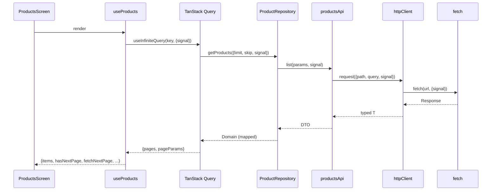
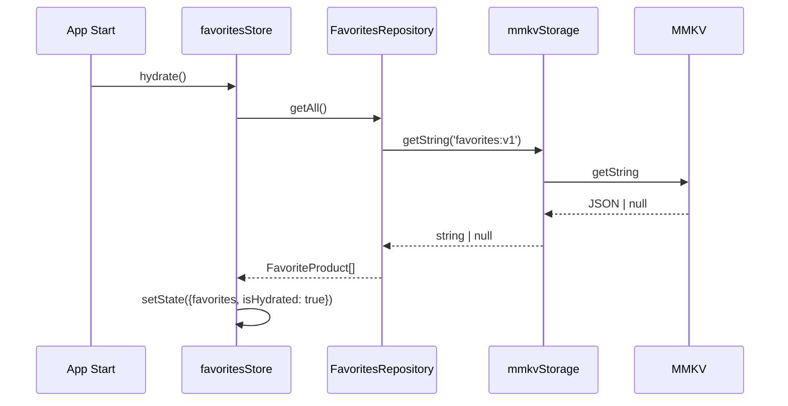

# Plan — topazProducts

## Tech Stack (pinned)

| Component | Version | Rationale |
|-----------|---------|-----------|
| React Native | 0.81.x | Project target |
| React | 19.1.x | RN 0.81 baseline |
| TypeScript | 5.8.x | RN 0.81 template baseline |
| @react-native-community/cli | 20.x | CLI for 0.81 |
| React Navigation | 7.x (native, native-stack, bottom-tabs) | Typed nav |
| react-native-screens | 4.15.0 (exact) | Last 4.x before SearchBarNativeComponent codegen regression (4.16+); RN 0.81 codegen can't parse newer Fabric command syntax |
| react-native-gesture-handler | 2.18.x or 2.20+ | Compat with RN 0.81 |
| react-native-reanimated | 3.16.7 | Stable with RN 0.81 |
| react-native-safe-area-context | 5.4.x | Per repo baseline |
| @tanstack/react-query | 5.x | Server state |
| zustand | 5.x | Client state |
| react-native-mmkv | 3.x (latest 3.x compat 0.81) | Persistence |
| @d11/react-native-fast-image | 8.x | Image caching |
| Jest | 29.x | Per repo baseline |
| @testing-library/react-native | 12.x | Hook + UI testing |
| ESLint | 8.x | Per repo baseline |
| Prettier | 2.8.8 | Per repo baseline |
| babel-plugin-module-resolver | 5.x (dev) | `@/*` alias transform — tsconfig paths alone not visible to Metro |

## Library Matrix

Cross-config consistency rules for libraries that touch multiple toolchain layers.
Any addition here MUST be reflected in every consumer file (TS / Babel / Metro / Jest).

### `@/*` alias (`src/*`)

| Layer | Config | Field |
|---|---|---|
| TypeScript | `tsconfig.json` | `compilerOptions.paths["@/*"]` |
| Babel (Metro) | `babel.config.js` | `plugins[0]` module-resolver `alias["@"]` |
| Jest | `jest.config.js` | `moduleNameMapper["^@/(.*)$"]` |

When updating the alias, edit all three. Out-of-sync manifests as
`Unable to resolve module @/...` at runtime even though `tsc --noEmit` passes.

## Architecture

### Layer Diagram

```
UI (Screens, Components)
   │
   ▼
Feature Hooks (TanStack Query / Zustand consumer)
   │
   ▼
Repository (interface + concrete impl)
   │
   ▼
Api Module ───► httpClient ───► fetch
Storage Adapter ───► MMKV
```

### Folder Structure

```
topazProducts/
├── App.tsx                                # raíz, monta <AppProviders><Navigation/></AppProviders>
├── index.js
├── package.json
└── src/
    ├── AppProviders.tsx                   # composition root
    │
    ├── api/
    │   ├── httpClient.ts                  # fetch + AbortSignal + timeout
    │   ├── config.ts                      # baseURL, default timeout
    │   ├── errors.ts                      # AppError + mapAppError
    │   └── queryKeys.ts                   # keys centralizadas TanStack Query
    │
    ├── domain/                            # interfaces + modelos puros
    │   ├── product/
    │   │   ├── Product.ts
    │   │   ├── ProductCategory.ts
    │   │   ├── PaginatedProducts.ts
    │   │   └── IProductRepository.ts
    │   └── favorites/
    │       ├── FavoriteProduct.ts
    │       └── IFavoritesRepository.ts
    │
    ├── features/
    │   ├── products/
    │   │   ├── api/
    │   │   │   ├── productsDto.ts         # ProductApiDto, ProductsResponseDto, ProductCategoryDto
    │   │   │   └── productsApi.ts         # 5 endpoints, signal-aware
    │   │   ├── mappers/
    │   │   │   └── productMapper.ts       # mapProductDto, mapProductsResponseDto, mapCategoryDto
    │   │   ├── repository/
    │   │   │   └── DummyJsonProductRepository.ts
    │   │   ├── hooks/
    │   │   │   ├── useProducts.ts
    │   │   │   ├── useProduct.ts
    │   │   │   ├── useCategories.ts
    │   │   │   └── useDebouncedValue.ts
    │   │   ├── components/
    │   │   │   ├── ProductCard.tsx
    │   │   │   ├── ProductSkeleton.tsx
    │   │   │   ├── CategoryChips.tsx
    │   │   │   ├── SearchBar.tsx
    │   │   │   └── ProductGridFooter.tsx
    │   │   └── screens/
    │   │       ├── ProductsScreen.tsx
    │   │       └── ProductDetailScreen.tsx
    │   │
    │   └── favorites/
    │       ├── repository/
    │       │   └── MMKVFavoritesRepository.ts
    │       ├── hooks/
    │       │   ├── useFavorites.ts
    │       │   ├── useToggleFavorite.ts
    │       │   └── useIsFavorite.ts
    │       ├── store/
    │       │   └── favoritesStore.ts
    │       ├── components/
    │       │   ├── FavoriteButton.tsx     # Reanimated 3
    │       │   └── FavoriteListItem.tsx
    │       └── screens/
    │           └── FavoritesScreen.tsx
    │
    ├── storage/
    │   └── mmkv.ts                        # único import de react-native-mmkv
    │
    ├── components/                        # shared UI
    │   ├── ErrorState.tsx
    │   ├── EmptyState.tsx
    │   ├── RetryButton.tsx
    │   ├── Screen.tsx
    │   └── Divider.tsx
    │
    ├── hooks/                             # shared hooks
    │   ├── useAppState.ts
    │   └── useMounted.ts
    │
    ├── utils/                             # shared utils
    │   ├── currency.ts
    │   ├── discount.ts
    │   └── truncate.ts
    │
    ├── store/
    │   └── queryClient.ts                 # TanStack Query client configured
    │
    ├── navigation/
    │   ├── RootTabs.tsx
    │   ├── ProductsStack.tsx
    │   └── types.ts                       # RootTabParamList, ProductsStackParamList
    │
    └── theme/
        ├── tokens.ts
        ├── lightTheme.ts
        ├── darkTheme.ts
        ├── typography.ts
        ├── spacing.ts
        ├── radius.ts
        ├── ThemeContext.ts
        ├── ThemeProvider.tsx
        └── useAppTheme.ts
```

### Dependency Rules (enforced via `no-restricted-imports`)

| Folder | May import | MUST NOT import |
|--------|-----------|-----------------|
| `src/domain/*` | nothing | `src/api/`, `src/features/`, `src/storage/`, `src/theme/`, `react`, `react-native` |
| `src/api/*` | `src/domain/*` (type-only) | `src/features/`, `src/storage/` |
| `src/storage/*` | `react-native-mmkv` only | `src/features/`, `src/domain/`, `src/api/` |
| `src/features/*/repository/*` | `src/domain/`, `src/api/`, `src/storage/`, `src/features/*/api` | `src/features/*/components`, `src/features/*/screens`, `src/features/*/hooks` |
| `src/features/*/api/*` | `src/api/`, `src/domain/` (type-only) | `src/features/*/repository`, `src/storage/` |
| `src/features/*/mappers/*` | `src/domain/`, `src/features/*/api` | `src/features/*/repository`, `src/storage/` |
| `src/features/*/hooks/*` | `src/domain/`, `src/api/`, `src/features/*/repository`, `src/features/*/mappers` | `src/features/*/components`, `src/features/*/screens` |
| `src/features/*/components/*` | `src/domain/`, `src/features/*/hooks`, `src/theme/`, `src/components/` | `src/features/*/repository`, `src/api/`, `src/storage/` |
| `src/features/*/screens/*` | `src/domain/`, `src/features/*/{hooks,components}`, `src/theme/`, `src/components/`, `src/navigation/` | `src/features/*/repository`, `src/api/`, `src/storage/` |
| `src/components/*` | `src/theme/` | `src/features/`, `src/api/`, `src/storage/` |
| `src/hooks/*` | `src/domain/`, `src/api/` | `src/features/`, `src/storage/` |
| `src/utils/*` | `src/domain/` | `src/features/`, `src/api/`, `src/storage/` |
| `src/store/*` | `src/api/`, `src/domain/` | `src/features/`, `src/storage/` |
| `src/navigation/*` | `src/features/*/screens`, `src/theme/`, `src/components/` | `src/features/*/repository`, `src/api/`, `src/storage/` |
| `src/theme/*` | nothing | everything else |
| `src/AppProviders.tsx` | everything (composition root) | nothing restricted |

## Data Flow





## State Machines

### Search vs Category (mutually exclusive)

```
States: ALL | SEARCHING | CATEGORY
Transitions:
  ALL → SEARCHING: debouncedQuery.length > 0
  ALL → CATEGORY: selectedCategory !== null
  SEARCHING → ALL: debouncedQuery cleared
  SEARCHING → CATEGORY: user taps category chip
  CATEGORY → ALL: user taps "All" chip
  CATEGORY → SEARCHING: user types in search bar
```

### Pagination

```
States: IDLE | LOADING | SUCCESS | ERROR | EXHAUSTED
Transitions:
  IDLE → LOADING: initial mount or filter change
  LOADING → SUCCESS: response.ok
  LOADING → ERROR: AppError thrown
  SUCCESS → LOADING: fetchNextPage + hasNextPage
  SUCCESS → EXHAUSTED: items.length === total
  ERROR → LOADING: retry
  LOADING → LOADING (abort): query changes
```

## API Contracts

```ts
// httpClient
interface RequestConfig {
  method: 'GET' | 'POST' | 'PUT' | 'PATCH' | 'DELETE';
  path: string;
  query?: Record<string, string | number | boolean | undefined>;
  signal?: AbortSignal;
  timeoutMs?: number; // default 15000
}

interface HttpClient {
  request<T>(config: RequestConfig): Promise<T>;
}

type AppError = NetworkError | TimeoutError | HttpError | ParseError | UnknownAppError;
```

```ts
// ProductRepository
interface ProductRepository {
  getProducts(p: {limit: number; skip: number; signal?: AbortSignal}): Promise<PaginatedProducts>;
  getProductById(id: number, signal?: AbortSignal): Promise<Product>;
  searchProducts(q: string, p: {limit: number; skip: number; signal?: AbortSignal}): Promise<PaginatedProducts>;
  getProductsByCategory(slug: string, p: {limit: number; skip: number; signal?: AbortSignal}): Promise<PaginatedProducts>;
  getCategories(signal?: AbortSignal): Promise<ProductCategory[]>;
}
```

```ts
// FavoritesRepository
interface FavoritesRepository {
  getAll(): FavoriteProduct[];
  save(fav: FavoriteProduct): void;
  remove(id: number): void;
  exists(id: number): boolean;
}
```

## Design Token Mapping (from design.md)

| Token | Light | Dark | Source |
|-------|-------|------|--------|
| `colors.canvas` | `#F2E9E4` | `#16182C` | design.md |
| `colors.card` | `#FAF6F0` | `#22192D` | design.md |
| `colors.accent` | `#8D5524` | `#C9ADA7` | design.md |
| `colors.primary` | `#2B2D42` | `#F2E9E4` | design.md |
| `colors.text` | `#2B2D42` | `#F2E9E4` | design.md |
| `colors.textMuted` | `#9A8C98` | `#C9ADA7` | design.md |
| `colors.border` | `rgba(154,140,152,0.2)` | `rgba(154,140,152,0.3)` | design.md |
| `colors.favoriteActive` | `#8D5524` | `#C9ADA7` | design.md |
| `colors.favoriteInactive` | `#9A8C98` | `#77767D` | design.md |
| `radius.card` | 18 | 18 | design.md |
| `radius.chip` | 12 | 12 | design.md |
| `radius.button` | 14 | 14 | design.md |
| `spacing.gutter` | 16 (1rem) | 16 | design.md |
| `spacing.margin` | 20 (1.25rem) | 20 | design.md |
| `elevation.card` | `0 8px 24px -4px rgba(43,45,66,0.04), 0 2px 6px 0 rgba(141,85,36,0.03)` | dimmer variant | design.md |
| `border.hairline` | `1px solid rgba(154,140,152,0.2)` | `rgba(154,140,152,0.3)` | design.md |

## Animation Spec (FavoriteButton)

```ts
// pseudocode
const scale = useSharedValue(1);
const animatedStyle = useAnimatedStyle(() => ({transform: [{scale: scale.value}]}));

const onPressIn  = () => { scale.value = withSpring(1.2, {damping: 8, stiffness: 200}); };
const onPressOut = () => { scale.value = withSpring(1,   {damping: 10, stiffness: 180}); };
```

Color transition: `favoriteInactive` → `favoriteActive` via `withTiming(180ms)`.

## Accessibility Spec

| Element | Label | Role | State |
|---------|-------|------|-------|
| FavoriteButton | "Add to favorites" / "Remove from favorites" | button | selected: isFavorite |
| ProductCard | `${title}, ${price}` | button | — |
| SearchBar | "Search products" | search | — |
| CategoryChip | category.name | button | selected: isActive |
| RetryButton | "Retry" | button | — |
| BottomTabs (each) | title | tab | selected: isFocused |

Touch targets: min 44×44 + `hitSlop={8}`.

## Performance Spec

- `FlatList` 2 cols, `keyExtractor={p => String(p.id)}`
- `onEndReachedThreshold={0.6}`, `removeClippedSubviews`, `windowSize={5}`
- `initialNumToRender={6}`, `maxToRenderPerBatch={10}`
- `FastImage` for product images; native `Image` only if justified
- No `getItemLayout` (heights vary by title length)
- `ProductCard` wrapped in `React.memo` (id + isFavorite comparison)
- No blanket `useMemo`/`useCallback`

## Error Handling

```ts
function mapAppError(e: AppError): string {
  switch (e.kind) {
    case 'network': return 'No connection. Check your network.';
    case 'timeout': return 'Request took too long.';
    case 'http':    return e.status === 404 ? 'Not found.' : 'Server error.';
    case 'parse':   return 'Unexpected response.';
    case 'unknown': return 'Something went wrong.';
  }
}
```

`GlobalErrorBoundary` catches synchronous render errors only.

## Edge Cases (top 25)

Each edge case is classified by automation strategy. A documented edge case
does NOT imply an automated test must exist.

Classifications:
- **MUST**: automated test is part of Phase 5 deliverable.
- **SHOULD**: automated test if time permits after MUST; otherwise covered by
  adjacent MUST tests or manual validation.
- **MANUAL**: validated manually (Slow 3G, OS settings, exploratory) — no test.
- **IMPL**: implementation handles it defensively; no dedicated test needed.
- **COVERED**: behavior naturally exercised by a MUST test elsewhere.

| ID | Case | Layer | Type | Automation |
|----|------|-------|------|------------|
| EDGE-001 | Offline | httpClient | network failure | MANUAL |
| EDGE-002 | Timeout | httpClient | timeout | MANUAL |
| EDGE-003 | 404 on detail | repo | not-found | COVERED (useProducts) |
| EDGE-004 | 500 server | repo | server-error | IMPL |
| EDGE-005 | Invalid JSON | httpClient | parse error | IMPL |
| EDGE-006 | Empty results | screen | empty-state | COVERED (useProducts) |
| EDGE-007 | Broken image | Image | image fail | MANUAL |
| EDGE-008 | Long title | ProductCard | truncation | SHOULD |
| EDGE-009 | Long description | Detail | truncation | MANUAL |
| EDGE-010 | price=0 | mapper + UI | edge | MUST (calculateDiscountedPrice.test) |
| EDGE-011 | discount=0 | discount util | edge | MUST (calculateDiscountedPrice.test) |
| EDGE-012 | rating=0 | ProductCard | hide stars | MANUAL |
| EDGE-013 | Duplicate pagination | useInfiniteQuery | dedupe | IMPL |
| EDGE-014 | Pagination reaches total | mapper + hook | stop | SHOULD (useProducts) |
| EDGE-015 | Rapid typing | debounce + signal | race | SHOULD (useDebouncedValue) |
| EDGE-016 | Rapid category switch | queryKey + signal | race | MANUAL |
| EDGE-017 | Rapid favorite toggle | store | race | SHOULD (useFavorites) |
| EDGE-018 | Corrupted MMKV | mmkvStorage | corrupt JSON | IMPL |
| EDGE-019 | App restart | hydration | persist | SHOULD (useFavorites) |
| EDGE-020 | Navigation away mid-fetch | hook | abort | MANUAL |
| EDGE-021 | Dark mode runtime change | theme | OS change | MANUAL |
| EDGE-022 | brand missing | mapper + UI | hide | MANUAL |
| EDGE-023 | images empty | Detail | fallback | MANUAL |
| EDGE-024 | tags empty | Detail | hide | MANUAL |
| EDGE-025 | AbortError | httpClient + hook | abort chain | IMPL |

## Testing Strategy (Phase 5 v2)

### Principle
**MINIMUM REQUIRED, HIGH VALUE TESTING.**

Edge cases documented ≠ automated tests. The 72-hour scope prioritizes
functional completeness, stability, and code quality over test count.

### MUST tests (4 files)

| File | Covers |
|------|--------|
| `src/features/products/hooks/__tests__/useProducts.test.ts` | Initial load success, error + retry, pagination, search ↔ category mutual exclusion |
| `src/features/favorites/hooks/__tests__/useFavorites.test.ts` | Add, remove, reactive cross-screen update, hydration |
| `src/shared/utils/__tests__/calculateDiscountedPrice.test.ts` | Discount > 0, discount = 0 |
| `src/features/products/screens/__tests__/ProductDetailScreen.test.tsx` | Integration: render product → tap FavoriteButton → icon toggles + state updates |

### SHOULD tests (only if MUST complete and time permits)

- `src/shared/utils/__tests__/formatCurrency.test.ts` — only if `formatCurrency`
  has own logic beyond `Intl.NumberFormat` wrapper.
- `src/features/products/hooks/__tests__/useDebouncedValue.test.ts` — only if
  debounce behavior is not naturally exercised by `useProducts.test.ts`.
- `src/features/products/mappers/__tests__/productMapper.test.ts` — only if
  mapper behavior is not covered by hook tests.

### Manual / Implementation (no test)

Everything else: timeouts, HTTP 4xx/5xx, invalid JSON, corrupted MMKV, rapid
toggling, navigation mid-fetch, image failures, dark mode runtime change,
a11y props, Reanimated internals, ErrorBoundary internals — all of these
are handled in implementation but validated by code review and manual
exploration. See Edge Cases table for per-edge classification.

### Mocking rule

For hooks and UI tests, mock at the **repository boundary**
(`ProductRepository`, `FavoritesRepository`). Do not mock `fetch` deeply in
unit tests; let integration coverage be implicit in production wiring.

### Coverage

There is **no required coverage percentage**. Time spent on tests must be
proportional to the 72-hour scope and prioritize MUST files.


## Acceptance Criteria (Given/When/Then)

### Products
- **AC-PROD-001** GIVEN ProductsScreen WHEN initial load THEN skeletons render
  for ~6 cards; AND on resolve, cards replace skeletons with zero layout shift.
- **AC-PROD-002** GIVEN list loaded WHEN scroll reaches end AND hasNextPage
  THEN fetchNextPage fires; AND footer shows spinner.
- **AC-PROD-003** GIVEN items.length === total WHEN user scrolls THEN no extra
  request fires.

### Search
- **AC-SEARCH-001** GIVEN ProductsScreen WHEN user types "phone" THEN no request
  before 350ms; AND after 350ms `/products/search?q=phone` fires; AND category
  resets to All; AND obsolete requests abort.
- **AC-SEARCH-002** GIVEN active query WHEN user types "phone case" THEN only
  the last query is sent; AND previous request is aborted.

### Category
- **AC-CAT-001** GIVEN category "Laptops" active WHEN user taps "Smartphones"
  THEN `/products/category/smartphones` fires; AND search box clears.
- **AC-CAT-002** GIVEN category active WHEN user types in search THEN category
  resets; AND search takes precedence.

### Pagination
- **AC-PAGE-001** GIVEN total=100, limit=20 WHEN user scrolls 5 times THEN 5
  requests fire (skip 0,20,40,60,80); AND 6th scroll fires none.

### Detail
- **AC-DET-001** GIVEN ProductsScreen WHEN user taps a card THEN navigates to
  ProductDetail; AND carousel + data render.
- **AC-DET-002** GIVEN invalid id WHEN screen opens THEN "Product not found"
  renders; AND back button works.

### Favorites
- **AC-FAV-001** GIVEN ProductCard WHEN user taps FavoriteButton THEN icon
  updates; AND FavoritesScreen shows the item without reload; AND after
  force-quit + reopen, item persists.
- **AC-FAV-002** GIVEN item in FavoritesScreen WHEN user taps its
  FavoriteButton THEN item disappears; AND ProductCard reflects unfavorited.

### Navigation
- **AC-NAV-001** GIVEN app open WHEN Products → Detail → Back THEN returns to
  Products with scroll preserved.

### Storage
- **AC-STO-001** GIVEN app with favorites WHEN force quit + reopen THEN
  favorites persist.

### Errors
- **AC-ERR-001** GIVEN offline WHEN user opens app THEN EmptyState shows "No
  connection" + Retry.
- **AC-ERR-002** GIVEN in-use app WHEN toggling airplane mode THEN queries fail
  with NetworkError; AND no crash.

### Loading
- **AC-LOAD-001** GIVEN initial load WHEN data pending THEN skeletons visible;
  AND skeletons have identical height to final cards.

### Animation
- **AC-ANIM-001** GIVEN FavoriteButton WHEN press in THEN scale springs to 1.2;
  AND on release springs back to 1.

### Accessibility
- **AC-A11Y-001** GIVEN VoiceOver/TalkBack active WHEN focusing FavoriteButton
  THEN label reflects current state ("Add/Remove favorites").
- **AC-A11Y-002** GIVEN any interactive element WHEN measuring THEN hit area
  ≥ 44×44.

### Dark Mode
- **AC-DARK-001** GIVEN system dark mode WHEN app opens THEN darkTheme applied;
  AND components consume tokens, no hardcoded colors.

## Traceability Matrix

Test Class values:
- `MUST: <file>` — automated test required by Phase 5.
- `SHOULD: <file>` — automated test recommended; may be skipped under time pressure.
- `Integration: <file>` — single integration test deliverable.
- `IMPL` — handled in implementation; no dedicated test.
- `MANUAL` — validated manually.
- `Covered by <file>` — exercised naturally by another MUST test.
- `code review` — verified via code review.

| Req ID | Spec § | Implementation | Test Class |
|--------|--------|----------------|------------|
| ARCH-001 | plan §Folder Structure | `src/{domain,features,api,storage,components,hooks,utils,store,navigation,theme}` | code review |
| ARCH-002 | plan §Layer Diagram | `src/features/*/repository/*` (impls) | IMPL |
| ARCH-003 | plan §Dep Rules | `no-restricted-imports` | code review (lint enforces) |
| ARCH-004 | plan §Dep Rules | `src/storage/mmkv.ts` isolation | code review (lint enforces) |
| STORE-001 | plan §State Machines | `src/store/queryClient.ts` | MUST: useProducts.test.ts (indirect) |
| STORE-002 | plan §State Machines | `favoritesStore.ts` | MUST: useFavorites.test.ts |
| STORE-003 | plan §Data Flow | `src/storage/mmkv.ts` + repo | MUST: useFavorites.test.ts (hydration) |
| PROD-001 | plan §Folder Structure | ProductsScreen + ProductCard | Integration: ProductDetailScreen.test.tsx |
| PROD-002 | data-model §Pagination | useInfiniteQuery | MUST: useProducts.test.ts |
| PROD-003 | data-model §Pagination | productMapper.ts (mapProductsResponseDto) | Covered by useProducts.test.ts |
| SEARCH-001 | plan §API | `features/products/api/productsApi.ts` | IMPL |
| SEARCH-002 | plan §Animation | `features/products/hooks/useDebouncedValue.ts` | SHOULD: useDebouncedValue.test.ts |
| SEARCH-003 | plan §Net | httpClient signal | IMPL |
| SEARCH-004 | plan §State Machines | useProducts state machine | MUST: useProducts.test.ts |
| CAT-001 | plan §API | `useCategories` | Covered by ProductsScreen integration |
| CAT-002 | plan §Folder | CategoryChips | MANUAL |
| CAT-003 | plan §API | DummyJsonProductRepository | IMPL |
| CAT-004 | plan §State Machines | useProducts state machine | MUST: useProducts.test.ts |
| DETAIL-001 | plan §API | `useProduct` | Covered by ProductDetailScreen.test.tsx |
| DETAIL-002 | plan §Folder | ProductDetailScreen | Integration: ProductDetailScreen.test.tsx |
| DETAIL-003 | plan §Folder | ProductDetailScreen | Integration: ProductDetailScreen.test.tsx |
| DETAIL-004 | plan §Folder | ProductDetailScreen | MANUAL (secondary fields) |
| FAV-001 | plan §Data Flow | `src/storage/mmkv.ts` + MMKVFavoritesRepository | MUST: useFavorites.test.ts |
| FAV-002 | plan §Folder | FavoritesScreen | Integration: ProductDetailScreen.test.tsx |
| FAV-003 | plan §Data Flow | `favoritesStore.ts` (Zustand) | MUST: useFavorites.test.ts |
| FAV-004 | data-model §FavoriteProduct | `domain/favorites/FavoriteProduct.ts` | IMPL |
| REPO-001 | plan §API Contracts | `domain/product/IProductRepository.ts` | IMPL |
| REPO-002 | plan §API Contracts | signal in all methods | IMPL (validated via hook integration) |
| REPO-003 | plan §API Contracts | `domain/favorites/IFavoritesRepository.ts` | IMPL |
| NET-001 | plan §API Contracts | `api/httpClient.ts` | MANUAL (Slow 3G / DevTools) |
| NET-002 | plan §Dep Rules | httpClient URL composition | IMPL |
| NET-003 | plan §Data Flow | signal propagation | IMPL |
| ERR-001 | plan §Errors | `api/errors.ts` types | IMPL |
| ERR-002 | plan §Errors | `mapAppError` | IMPL |
| ERR-003 | plan §Errors | ErrorBoundary | MANUAL (cold launch with thrown render) |
| LOAD-001 | plan §Folder | ProductSkeleton | MANUAL |
| LOAD-002 | plan §Folder | ProductGridFooter | MANUAL |
| LOAD-003 | plan §Folder | skeleton dims = card dims | code review |
| ANIM-001 | plan §Animation | FavoriteButton | MANUAL (visual) |
| ANIM-002 | plan §Animation | lint ban on Animated | code review (lint enforces) |
| NAV-001 | plan §Folder | `navigation/RootTabs.tsx` | MANUAL |
| NAV-002 | plan §Folder | `navigation/ProductsStack.tsx` | MANUAL |
| NAV-003 | plan §Folder | FavoritesScreen | MANUAL |
| NAV-004 | plan §Folder | structural | code review |
| NAV-005 | plan §Folder | `navigation/types.ts` | code review (typecheck enforces) |
| PERF-001 | plan §Performance | FlatList keyExtractor | code review |
| PERF-002 | plan §Performance | FastImage install | code review |
| PERF-003 | plan §Performance | review | code review |
| PERF-004 | plan §Performance | review | code review |
| A11Y-001 | plan §A11y | components | MANUAL (VoiceOver / TalkBack) |
| A11Y-002 | plan §A11y | styles | code review |
| A11Y-003 | plan §A11y | icons + text | code review |
| DSGN-001 | plan §Token Mapping | design.md ref | code review |
| DSGN-002 | plan §Token Mapping | tokens | code review (grep CI) |
| DSGN-003 | plan §Folder | `theme/ThemeProvider.tsx` | MANUAL (system Settings toggle) |
| DARK-001 | plan §Token Mapping | useColorScheme | MANUAL |
| TEST-001 | tasks §Phase 5 | hooks + utils | MUST (4 files) |
| TEST-002 | tasks §Phase 5 | integration | Integration: ProductDetailScreen.test.tsx |
| TEST-003 | tasks §Phase 5 | review | code review |
| MOCK-001 | tasks §Phase 5 | jest.mock patterns | IMPL (mocking at repo boundary) |
| LINT-001 | plan §Folder | `.eslintrc.js` | code review (lint enforces) |
| LINT-002 | plan §Folder | script | CI |
| LINT-003 | plan §Folder | script | CI |
| CI-001 | tasks §Phase 6 | `.github/workflows/ci.yml` | CI run |
| NATIVE-001 | tasks §Phase 7 | NativeCurrencyFormatter | SHOULD (wrapper tests) |
| EDGE-010 | plan §Edge Cases | calculateDiscountedPrice | MUST: calculateDiscountedPrice.test.ts |
| EDGE-011 | plan §Edge Cases | calculateDiscountedPrice | MUST: calculateDiscountedPrice.test.ts |
| Other EDGE-NNN | plan §Edge Cases | varies | See § Edge Cases table for per-edge classification |

## 72-Hour Execution Plan

| Phase | Hours | Deliverable |
|-------|-------|-------------|
| Phase 1 — Foundation | 8 | navigation, providers, theme, lint, format |
| Phase 2 — Data Layer | 8 | httpClient, DTOs, mappers, repos, queryKeys |
| Phase 3 — Products + Search + Category | 14 | full list experience |
| Phase 4 — Detail + Favorites | 14 | full secondary experience |
| Phase 5 — Quality | 4 | MUST tests only (see § Testing Strategy); no % coverage target |
| Phase 6 — Hardening | 10 | a11y, dark mode, ErrorBoundary, CI, README |
| Phase 7 — Bonus (optional) | 12 | NativeCurrencyFormatter |
| **Total** | **70** + buffer | |

Total scope: 70 nominal hours + ~2h buffer absorbed across phases.
Phase 5 was reduced from 8h to 4h per Testing Strategy v2 (MINIMUM REQUIRED,
HIGH VALUE TESTING); the freed budget extends Phase 6 (Hardening) where
CI, README, screenshots, and final validation live.

Critical path: Phase 1 → 2 → 3 → 4 → 5 → 6. Phase 7 only if 6 closes.

## Definition of Done

A project is DONE when ALL of the following are true:

- `npm run lint` exits 0
- `npm run lint:format` exits 0
- `npm test -- --ci` exits 0
- `npx tsc --noEmit` exits 0
- `npm run android` boots app; navigates tabs; opens detail; toggles favorite
- `npm run ios` boots app; navigates tabs; opens detail; toggles favorite
- Pagination works; stops at `total`
- Search debounce works (350ms); cancels obsolete; clears category
- Category filter works; clears search
- Favorites persist across cold start; reactive cross-screen
- Errors render EmptyState/Retry; no stack traces; no crashes
- Skeletons render on initial load; no layout shift
- FavoriteButton uses Reanimated 3 (`useSharedValue`, `withSpring`)
- Navigation typed (`RootTabParamList`, `ProductsStackParamList`)
- `accessibilityLabel`/`Role`/`State` on interactives; touch targets ≥ 44×44
- Dark mode toggles with OS via `useColorScheme`
- No `fetch` import in screens (CI grep)
- No `react-native-mmkv` import outside `src/storage/mmkv.ts` (CI grep)
- No `Animated` API in `features/favorites/` (CI grep)
- No `any` without justification comment (lint)
- `README.md` complete per `tasks.md` § Phase 6
- Traceability Matrix in `plan.md` references every MUST
- CI workflow green
- All MUST tests from § Testing Strategy are implemented and passing
- At least one meaningful integration test exists (not "renders without crashing")
- SHOULD tests implemented only when time permits after all MUST close
- Secondary edge cases MAY be validated manually; automated coverage is not
  a blocker for completion. Proportional to the 72-hour scope.
